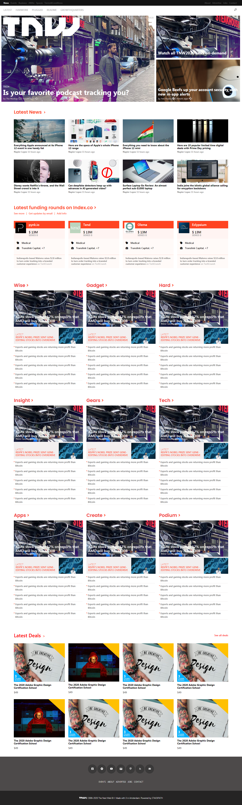

# the-next-web-responsive-page-clone
This project is about cloning the next web responsive page. We use two breakpoints from the responsive page, 768px and 1024px for mobile L to tablet and tablet to laptop view port transitions.
This project is about cloning the next web responsive page. We use two breakpoints from the responsive page, 425px and 768px for mobile L to tablet and tablet to laptop viewports transitions.

## Built With

- HTML
- CSS
- Google Fonts

 

## Live Demo

[Live Demo Link](https://henatan99.github.io/the-next-web-responsive-page-clone)

## Getting Started

To get local copy up and running just clone the Repository.

## Authors

:bust_in_silhouette: **Author1**

- GitHub: [@henatan99](https://github.com/henatan99)
- Twitter: [@henatan99](https://twitter.com/henatan99)
- LinkedIn: [Henok Mossissa](https://www.linkedin.com/in/henok-mekonnen-2a251613/)

:bust_in_silhouette: **Author2**

- GitHub: [@davidosky007](https://github.com/davidosky007)
- Twitter: [@davidosky2](https://twitter.com/Davidosky2)
- LinkedIn: [David Bassey](https://www.linkedin.com/in/david-bassey-2b9671199/)

## :handshake: Contributing

Contributions, issues, and feature requests are welcome!

Feel free to check the [issues page](https://github.com/henatan99/the-next-web-responsive-page-clone/issues/1).

## Show your support

Give a :star: if you like this project

## Acknowledgments

- [Font-awesome](https://fontawesome.com/) for its Awesome Icons
- [Google Fonts](https://fonts.google.com/) for its Amazing Fonts
